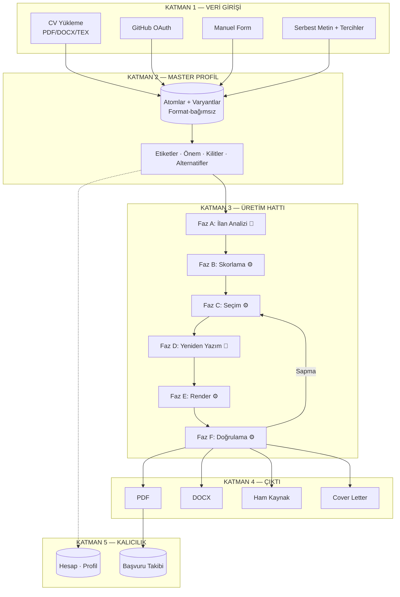

# Bölüm III — Sistem Mimarisi (9-11)

> AtomCV spec · [INDEX](../INDEX.md) · bu dosya yalnız aşağıdaki bölümleri içerir.

---

# BÖLÜM III — SİSTEM MİMARİSİ

## 9. Mimari Genel Bakış

### 9.1 Katmanlı yapı



### 9.2 Katman sorumlulukları

| Katman | Sorumluluk | Bilmediği |
|---|---|---|
| 1 — Veri Girişi | Ham veriyi standart atom yapısına çevirmek | Nasıl skorlanacağı, nasıl render edileceği |
| 2 — Master Profil | Tek doğruluk kaynağı (single source of truth) | Hangi formatta çıktı üretileceği |
| 3 — Üretim Hattı | Profil + İlan → optimize seçim | Hangi formatların desteklendiği (sadece kapasite parametresi alır) |
| 4 — Çıktı | Seçilmiş içeriği formata dökmek | Nasıl seçildiği |
| 5 — Kalıcılık | Hesap, geçmiş, tercihler | İş mantığı |

**Bağımsızlık prensibi:** Yeni format eklemek Katman 3'ü, yeni skorlama kriteri eklemek Katman 4'ü etkilemez.

---

## 10. Modül Yapısı

> **Repo ayrımı:** Proje iki ayrı GitHub reposundan oluşur — `atomcv-backend` ve `atomcv-frontend`. Aşağıdaki modül yapısı **yalnızca backend reposunu** tanımlar. Frontend yapısı Bölüm 36 ve XI-B.3'tedir. Repo ayrımının tüm sonuçları Bölüm XI-B.1'de toplanmıştır.

### 10.1 Modüler monolit organizasyonu (backend repo)

```
src/main/java/com/mustafatetik/atomcv/
├── identity/                    # Kimlik, oturum, hesap
│   ├── api/                     #   REST controller'lar
│   ├── challenge/               #   Turnstile doğrulaması (§ 44.4)
│   ├── domain/                  #   User, Session, OAuthIdentity
│   ├── oauth/                   #   Sağlayıcı adaptörleri, state (§ 40.6.1)
│   ├── ratelimit/               #   Üç katmanlı giriş limiti (§ 40.5.1)
│   ├── service/
│   └── repository/
├── profile/                     # Master Profil
│   ├── api/
│   ├── domain/                  #   Profile, Section, Entry, Atom, AtomVariant,
│   │                            #   ProfileTree, content/{RichContent, Run, Mark, ContentShape}
│   ├── seed/                    #   Golden profillerin okuyucusu + DevSeeder
│   ├── service/                 #   ProfileAssembler, ProfileWriter, senkron
│   └── repository/              #   kapsamlı cepheler + paket-özel Spring Data arayüzleri
├── ingestion/                   # Profil oluşturma
│   ├── api/
│   ├── extraction/              #   PDF/DOCX/TEX metin çıkarımı
│   ├── structuring/             #   LLM ile yapılandırma
│   ├── normalization/           #   Beceri, tarih, run dönüşümü
│   ├── github/                  #   GitHub entegrasyonu
│   └── service/                 #   Çıkarım işi, profile yazma
├── generation/                  # Üretim hattı
│   ├── api/
│   ├── domain/                  #   Generation, GenerationFeedback, SupportGrant
│   ├── pipeline/                #   GenerationPipeline, ErrorPresenter
│   │                            #   (PipelineContext yok — § 17.1)
│   ├── phases/                  #   analysis (A), edit (G)
│   ├── scoring/                 #   Faz B — skorlama algoritması
│   ├── selection/               #   Faz C — bin-packing optimizasyon
│   ├── rewrite/                 #   Faz D — yeniden yazım + doğrulayıcılar
│   ├── render/                  #   Faz E — RenderRequest kurulumu
│   ├── coverletter/             #   Bölüm 34
│   ├── validation/              #   FitReport, AtsCheck (Faz F)
│   ├── support/                 #   § 48.4'ün çevrimdışı okuyucusu, § 48.5'in replay'i
│   ├── service/                 #   Üretim, yeniden koşu, indirme, geri bildirim
│   └── repository/
├── rendering/                   # Render katmanı
│   ├── api/                     #   Şablon kataloğu, özelleştirme uçları (§ 33)
│   ├── domain/                  #   SavedCustomization, TemplateCapacity
│   ├── model/                   #   RenderRequest, RenderableSection
│   ├── latex/                   #   LatexRenderer, InlineRenderer, escape
│   ├── html/
│   ├── docx/
│   ├── measurement/             #   Ölçüm dokümanı, log parse, kapasite
│   ├── template/                #   Şablon config, customization
│   ├── service/                 #   RenderCostService, ölçüm işi
│   └── repository/
│   #   kökte: DocumentRenderer, DocumentWriter, DocumentWriters, OutputFormat (§ 22.2)
├── llm/                         # LLM Gateway
│   ├── gateway/                 #   LlmProvider arayüzü, chain, devre kesici
│   ├── providers/               #   OpenRouter, Gemini, OpenAI, Anthropic, DeepSeek
│   ├── prompts/                 #   PromptRegistry
│   ├── fake/                    #   FakeLlmProvider + fixture deposu (§ 54.2)
│   ├── eval/                    #   § 53.4'ün eşikleri ve raporu
│   └── telemetry/               #   llm_invocations kaydı
├── embedding/                   # Embedding altyapısı
├── compilation/                 # LaTeX derleme istemcisi
├── jobs/                        # Kuyruk ve worker
│   ├── api/
│   ├── queue/
│   ├── workers/
│   └── sse/                     #   İlerleme bildirimi
├── tracking/                    # Başvuru takibi (api/domain/service/repository)
├── billing/                     # Kota, maliyet, anomali, kill switch
├── email/                       # Gönderici, düz Java şablonlar, webhook (§ 57.7)
├── retention/                   # Saklama süpürmeleri (§ 57.4)
└── shared/                      # Ortak
    ├── security/                #   User-scoped repository base, ProfileRef, CSRF
    ├── error/                   #   Result, PipelineError, ErrorCode, Resolution
    ├── wire/                    #   İki modülün paylaştığı tel sözlükleri (§ 31.6.5)
    ├── math/                    #   Vectors — kosinüs tek yerde (§ 21.6.1)
    ├── ratelimit/               #   Redis kayan pencere (§ 40.5.1)
    ├── text/
    ├── config/
    └── util/
```

> **Ağaç bir aşama boyunca eksikti** (düzeltme, denetim 2026-09-20). On bir
> paket hiç yazılı değildi — `shared.wire` ve `shared.math` dâhil, ki ikisini de
> spec'in gövdesi adıyla anıyor (§ 31.6.5, § 21.6.1) — ve `generation` ile
> `rendering` kendi `api`/`domain`/`service`/`repository` katmanlarını
> taşıdıkları hâlde burada taşımıyordu. INDEX "modül yerleşimi" sorusunu buraya
> yolluyor, yani eksik olan ağaç cevabın kendisiydi.

### 10.2 Modüller arası kurallar

1. **Modüller yalnızca public arayüzler üzerinden haberleşir.** İç sınıflar package-private.
2. **Döngüsel bağımlılık yasak.** ArchUnit ile denetlenir.
3. **`generation` modülü `rendering`'i yalnızca `CapacityModel` üzerinden tanır** — hangi formatların desteklendiğini bilmez. **ArchUnit ile denetlenir** (`generationDoesNotKnowTheFormats`).
4. **`shared` hiçbir iş modülüne bağımlı olamaz.**

> **Kural 3 bir aşama boyunca çiğnendi, ve kimse kontrol etmiyordu**
> (denetim, 2026-09-16). `GenerationDownloadService` `DocxDocumentWriter` ve
> `HtmlDocumentWriter`'ı alan olarak tutuyordu, üstündeki controller format
> adlarını dört dallı bir dizge karşılaştırmasıyla çözüyordu: ürünün çıktı
> formatlarının listesi, onu tutmaya en az hakkı olan iki yerde yazılıydı, ve
> dördüncü bir format eklemek `generation`'ı düzenlemek demekti — § 1.2'nin
> "bağımsız eklentiler" iddiasının tam tersi.
>
> Çözüm § 22.2'de: format soyutlaması `DocumentWriter`'a taşındı,
> `DocumentWriters` § 6'nın Factory'si oldu. **Sınır artık somut format
> paketleri**; `..rendering..`'in kökü açık kalmak zorunda, çünkü boru hattı
> `DocumentRenderer`'ı sürüyor ve bir indirme `DocumentWriter` çözüyor —
> ikisi de hiçbir format adı anmıyor.
>
> **Tek istisna `ReplayRun`**, ve gerekçesi javadoc'unda: § 48.5'in
> çevrimdışı aracı, Spring bağlamı olmayan bir `main`, ve Faz E tanımı gereği
> LaTeX. Orada renderer'ı adlandırmak formatlar arasından seçmek değil,
> replay edilen şeyi adlandırmak.

```java
@ArchTest
static final ArchRule moduleDependencies = 
    slices().matching("com.mustafatetik.atomcv.(*)..")
            .should().beFreeOfCycles();

@ArchTest
static final ArchRule sharedIsIndependent =
    noClasses().that().resideInAPackage("..shared..")
               .should().dependOnClassesThat().resideInAnyPackage(
                   "..profile..", "..generation..", "..rendering..");
```

---

## 11. Deployment Topolojisi

### 11.1 Container yapısı

```yaml
# docker-compose.prod.yml
services:
  nginx:
    image: nginx:alpine
    ports: ["80:80", "443:443"]
    volumes:
      - ./nginx.conf:/etc/nginx/nginx.conf:ro
      - certbot-certs:/etc/letsencrypt:ro
    depends_on: [frontend, backend]

  frontend:
    # İki repo bağımsız deploy edilir, tek bir GIT_SHA yoktur (bkz. 47.3)
    image: ghcr.io/tetikmustafa/atomcv-frontend:${FRONTEND_SHA}
    environment:
      - NEXT_PUBLIC_API_URL=/api
    deploy:
      resources:
        limits: { cpus: '0.5', memory: 512M }

  backend:
    image: ghcr.io/tetikmustafa/atomcv-backend:${BACKEND_SHA}
    environment:
      - SPRING_PROFILES_ACTIVE=prod
      - JAVA_TOOL_OPTIONS=-XX:MaxRAMPercentage=70 -Duser.language=en -Duser.country=US
    depends_on: [postgres, redis, latex, embeddings]
    deploy:
      resources:
        limits: { cpus: '2.0', memory: 1G }

  postgres:
    image: pgvector/pgvector:pg17
    volumes: [pgdata:/var/lib/postgresql/data]
    environment:
      - POSTGRES_DB=atomcv
    command: >
      postgres -c shared_buffers=256MB
               -c max_connections=50
               -c wal_level=replica
               -c archive_mode=on
               -c archive_command='test ! -f /wal-archive/%f && cp %p /wal-archive/%f'
               -c archive_timeout=300
    deploy:
      resources:
        limits: { cpus: '1.5', memory: 1G }
        reservations: { cpus: '0.5', memory: 768M }   # garantili taban

  redis:
    image: redis:7-alpine
    command: redis-server --maxmemory 128mb --maxmemory-policy allkeys-lru
    volumes: [redisdata:/data]

  latex:
    build: ./docker/latex
    networks: [latex-isolated]          # ← dış ağ erişimi YOK
    read_only: true
    tmpfs: [/tmp]
    user: "1000:1000"
    security_opt: [no-new-privileges:true]
    cap_drop: [ALL]
    deploy:
      resources:
        limits: { cpus: '1.5', memory: 1G }

  embeddings:
    image: ghcr.io/huggingface/text-embeddings-inference:cpu-latest
    command: --model-id BAAI/bge-m3 --port 8081
    volumes: [modelcache:/data]
    deploy:
      resources:
        limits: { cpus: '1.0', memory: 2.5G }

  umami:
    image: ghcr.io/umami-software/umami:postgresql-latest
    profiles: [analytics]          # kapalıyken hiç başlamıyor (§ 46.5)
    depends_on: [postgres]

volumes:
  pgdata:
  redisdata:
  modelcache:
  certbot-certs:

networks:
  default:
  latex-isolated:
    internal: true    # ← internet erişimi yok
```

### 11.2 Nginx yapılandırması

```nginx
# Rate limit zonları
limit_req_zone $binary_remote_addr zone=api:10m rate=10r/s;
limit_req_zone $binary_remote_addr zone=auth:10m rate=1r/s;

server {
    listen 443 ssl http2;
    server_name atomcv.mustafatetik.com;

    ssl_certificate     /etc/letsencrypt/live/atomcv.mustafatetik.com/fullchain.pem;
    ssl_certificate_key /etc/letsencrypt/live/atomcv.mustafatetik.com/privkey.pem;
    ssl_protocols TLSv1.2 TLSv1.3;

    # Güvenlik header'ları
    add_header Strict-Transport-Security "max-age=31536000; includeSubDomains" always;
    add_header X-Content-Type-Options nosniff always;
    add_header X-Frame-Options DENY always;
    add_header Referrer-Policy strict-origin-when-cross-origin always;
    # Turnstile is a script this origin loads and an iframe it embeds, so the
    # policy has to name its host twice. The first draft did not name it at
    # all: the widget was blocked, no token was produced, and all three
    # endpoints behind it answered CHALLENGE_FAILED -- with both repositories'
    # tests green, because nginx is in neither of their lanes (B-100).
    add_header Content-Security-Policy "default-src 'self'; img-src 'self' data: https:; script-src 'self' 'unsafe-inline' https://challenges.cloudflare.com; style-src 'self' 'unsafe-inline'; connect-src 'self'; frame-src https://challenges.cloudflare.com" always;

    client_max_body_size 10M;

    # SSE — buffering KAPALI olmalı
    location /api/v1/jobs/ {
        proxy_pass http://backend:8080;
        proxy_buffering off;
        proxy_cache off;
        proxy_read_timeout 300s;
        proxy_http_version 1.1;
        proxy_set_header Connection '';
    }

    # Auth endpoint'leri — sıkı limit
    location /api/v1/auth/ {
        limit_req zone=auth burst=3 nodelay;
        proxy_pass http://backend:8080;
        include proxy_params.conf;
    }

    location /api/ {
        limit_req zone=api burst=20 nodelay;
        proxy_pass http://backend:8080;
        proxy_read_timeout 60s;
        include proxy_params.conf;
    }

    location / {
        proxy_pass http://frontend:3000;
        include proxy_params.conf;
    }

    gzip on;
    gzip_types text/plain text/css application/json application/javascript;
}
```

> **Son iki `postgres` satırı sonradan geldi ve gelmemiş olsaydı görünmezdi**
> (§ 49.3.1). `wal_level` ayarlıyken `archive_command` olmayan bir veritabanı
> hiçbir segment arşivlemiyor ve **yapılandırılmış görünüyor** — § 49.5'in
> "veri kaybı ~5 dakika" cümlesi gerçekte "03:00'a kadar" demek oluyordu.
> `archive_timeout` olmadan da pencere "beş dakika" değil "bir sonraki
> yazmaya kadar": sessiz bir veritabanı segmenti kapatmıyor. Komut `rclone`
> değil `cp` çağırıyor, çünkü o ikili `pgvector/pgvector:pg17` imajında yok;
> şifreleyip gönderen `scripts/archive-wal.sh`, host'ta, age anahtarının
> zaten yaşadığı yerde.

**Aynı domain kararı:** `atomcv.mustafatetik.com/api/*` → backend. Alt domain (`api.atomcv.mustafatetik.com`) kullanılmıyor çünkü: CORS gerekmiyor ve `SameSite=Strict` çerez çalışıyor.

---
